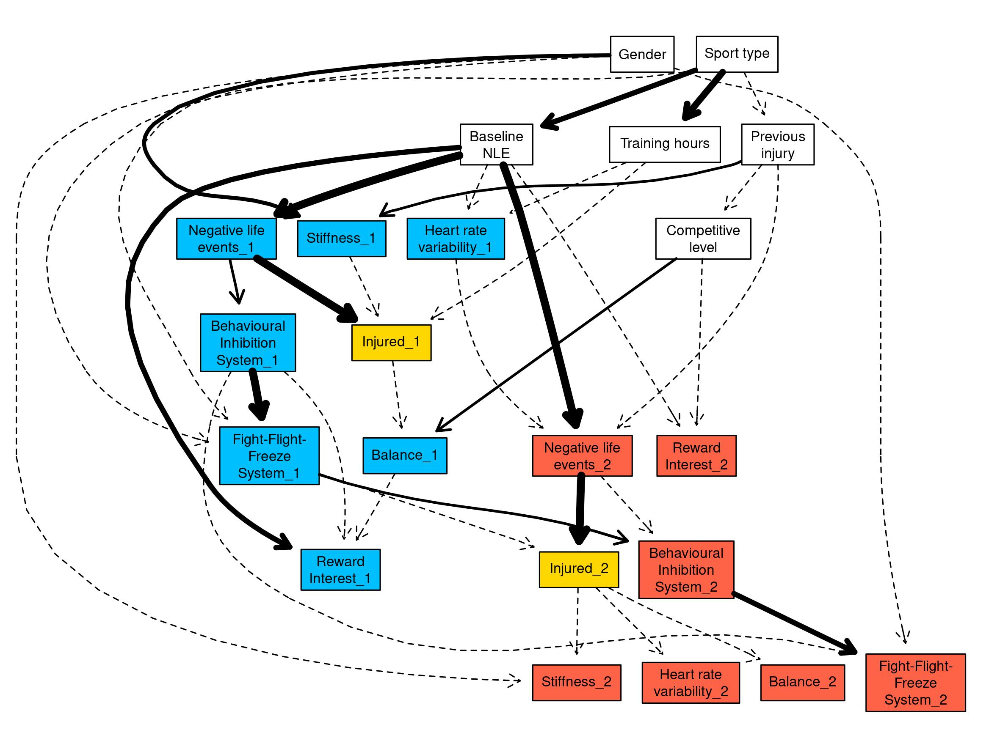
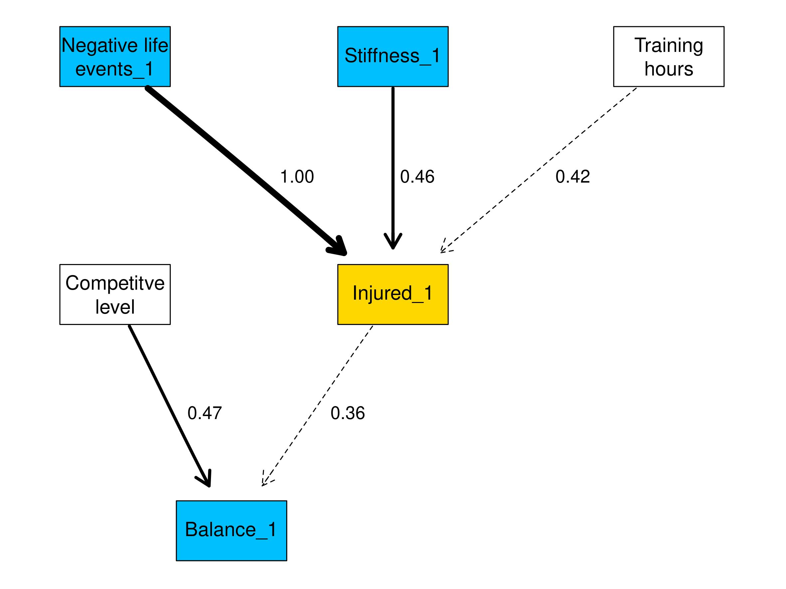

```{r setup, include=FALSE}
knitr::opts_chunk$set(echo = FALSE, warning = FALSE, message = FALSE)
pacman::p_load(knitr)
```


```{r fig1, fig.cap="Stress and injury model (Williams and Andersen, 1998).", fig.align='center',fig.pos = "!h"}

```

```{r fig2, fig.cap="mBESS positions (A-F). Top row, firm surface. Bottom row, foam surface. Left column, dominant leg stance. Middle column, non-dominant leg stance. Right column, Tandem leg stance.", out.width = "100%", fig.align='center',fig.pos = "!h"}

```


```{r fig3, fig.cap = 'Study design. For each time point (T), each box contains the number of participants who completed the data collection (\\textit{n}), the measures used for data collection and the approximate date of the data collection.', out.width = "100%"}

include_graphics("figures_doc/Fig3.jpeg")
```


```{r fig4, fig.cap = 'Outline of the protocol for each data collection.', out.width="100%", fig.align='center'}
include_graphics("figures_doc/Fig4.jpeg")
```